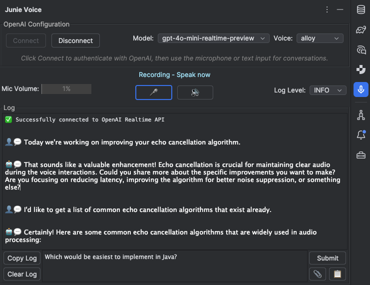

# Junie Voice



## About
I've frequently used ChatGPT voice mode as a sounding board—but it doesn't have access to my code base, so the best I
can do is copy-paste snippets in and out of it. I use JetBrain's Claude 4-backed Junie as my coding agent of
choice—Claude 4 is, IMHO, the best model for coding tasks, and Junie lives where I live: in IntelliJ. But without voice
capability, I can't riff with Junie the way I do with ChatGPT.

Junie Voice is a little vibe-coding project (that is, 10 hours vibing...30 hours coding) which attempts to give Junie
that voice capability. It's multi-modal: I can talk, type, and share images with it. When I'm ready for code, Junie
Voice seamlessly passes requirements off to Junie. And it adds a feature I've always wished existed in ChatGPT:
simultaneous, multi-modal output. Junie Voice can say one thing and print another, which finally fixes the problem of
the voice agent speaking code solutions aloud.

Junie Voice is a hobby project and proof of concept, while the IntelliJ userbase waits on JetBrains to give Junie
first-class voice capability. Poke around; fork if you like; I'd love a push back if you do anything cool with it. And
please don't judge the code quality...there are a couple of vibed files in here I've never even opened 😅

## Build
```
./gradlew buildPlugin
```

## Install
Install `build/distributions/junie-voice.zip`
[from disk](https://www.jetbrains.com/help/idea/managing-plugins.html#install_plugin_from_disk)

## TODO
1. Stop sending audio when it's below human speech amplitude
2. Fix "code blocks not block-level elements"
3. Fix "mic button sometimes becomes permanently disabled"
4. Clean up log messages
5. Add "agent can be interrupted _w/o push-to-interrupt_" (echo cancellation)
6. Add "API key can be remembered between sessions"
